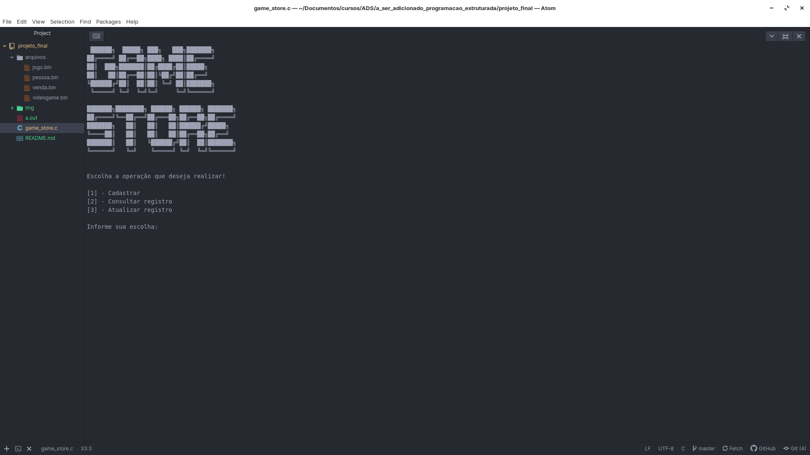

# Trabalho Final

Trabalho final a ser entregue na matéria Programação Estruturada, tem por objetivo trabalhar com funções, estruturas e manipulação de arquivos.

O tema escolhido foi uma loja de jogos, a interação é feita através do terminal.





Os dados são armazenados nos seguintes arquivos binários:

- videogame.bin
- jogo.bin
- pessoa.bin
- venda.bin


Abaixo utilizamos o diagrama do modelo relacional de banco de dados para poder representar os "arquivos" e seus atributos, fazem o papel de tabelas no programa. Não é gerada nenhuma base de dados, este trabalho tem por objetivo utilizar arquivos para armazenar os dados, o diagrama abaixo somente serve para representar os atributos a serem gravados em cada arquivo e as tabelas "entidades" representam os arquivos utilizados.


 


## Funções utilizadas para manipulação de arquivos

Os dados informados na função ```main()``` do programa, são salvos em variáveis de tipo heterogênea, ou seja variáveis **struct** do tipo videogame, jogo, pessoa ou venda, através de chamadas de função os dados podem ser salvos, listados, consultados ou alterados. Cada variável de tipo heterogênea armazena seus devidos atributos.


### Gravar dados de uma struct

- Função para cadastro de videogame, como parâmetro de entrada deve-se informar a variável heterogênea que armazena os dados do tipo **videogame**, pode retornar 0 (tudo ocorreu corretamente) ou 1 (falha ao abrir o arquivo).

  **Notação:**

  ```cadastrar_videogame(struct videogame v);```


- Função para cadastro de jogo, internamente utiliza a função ```videogame_busca_por_referencia()``` para verificar se o videogame informado existe no arquivo **videogame.bin**, como parâmetro de entrada deve-se informar a variável heterogênea que armazena os dados do tipo **jogo**, pode retornar 0 (tudo ocorreu corretamente), 1 (falha ao abrir o arquivo) ou 2 (não há registro referente ao ID informado).

  **Notação:**

  ```cadastrar_jogo(struct jogo j);```


- Função para cadastro de pessoa "cliente", como parâmetro de entrada deve-se informar a variável heterogênea que armazena os dados do tipo **pessoa**, pode retornar 0 (tudo ocorreu corretamente) ou 1 (falha ao abrir o arquivo).

  **Notação:**

  ```cadastrar_pessoa(struct pessoa p);```


- Função para cadastro de venda, internamente utiliza a função ```pessoa_busca_por_referencia()``` para verificar se o cliente informado existe no arquivo **cliente.bin** e a função ```jogo_busca_por_referencia()``` para verificar se o jogo informado existe no arquivo **jogo.bin**, como parâmetro de entrada deve-se informar a variável heterogênea que armazena os dados do tipo **venda**, pode retornar 0 (tudo ocorreu corretamente), 1 (falha ao abrir o arquivo) ou 2 (não há registro referente ao ID informado).

  **Notação:**

  ```cadastrar_venda(struct venda v);```


### Visualizar dados gravados

- Função para listagem dos registros contidos no arquivo **videogame.bin**, não deve-se informar nenhum parâmetro, basta apenas chamar a função, pode retornar 0 (tudo ocorreu corretamente), 1 (falha ao abrir o arquivo), ou 2 (ainda não há nenhum registro no arquivo).

  **Notação:**

  ```listar_videogame();```


- Função para listagem dos registros contidos no arquivo **jogo.bin**, esta função busca o nome do videogame no arquivo **videogame.bin** e apresenta o ID do jogo, Nome do videogame que o jogo pertence e Nome do jogo, não deve-se informar nenhum parâmetro, basta apenas chamar a função, pode retornar 0 (tudo ocorreu corretamente), 1 (falha ao abrir o arquivo), ou 2 (ainda não há nenhum registro no arquivo).

  **Notação:**

  ```listar_jogo();```


- Função para listagem dos registros contidos no arquivo **pessoa.bin**, não deve-se informar nenhum parâmetro, basta apenas chamar a função, pode retornar 0 (tudo ocorreu corretamente), 1 (falha ao abrir o arquivo), ou 2 (ainda não há nenhum registro no arquivo).

  **Notação:**

  ```listar_pessoa();```


- Função para listagem dos registros contidos no arquivo **venda.bin** esta função busca o nome do cliente no arquivo **pessoa.bin**  e nome do jogo no arquivo **jogo.bin**  e apresenta o Nome do cliente, Nome do jogo adquirido e Data da compra. Não deve-se informar nenhum parâmetro, basta apenas chamar a função, pode retornar 0 (tudo ocorreu corretamente), 1 (falha ao abrir o arquivo), ou 2 (ainda não há nenhum registro no arquivo).

  **Notação:**

  ```listar_venda();```


### Busca por referência

- Função para buscar videogame apartir do ID no arquivo **videogame.bin**, deve-se informar como parâmetros de entrada o ID do videogame e o modo (1 printa na tela o registro encontrado, outro valor somente confere se o registro existe), pode retornar 0 (tudo ocorreu corretamente) ou 1 (não há registro referente ao ID informado).

  **Notação:**

  ```videogame_busca_por_referencia(int id, int modo);```


- Função para buscar jogo apartir do ID no arquivo **jogo.bin**, deve-se informar como parâmetros de entrada o ID do jogo e o modo (1 printa na tela o registro encontrado, outro valor somente confere se o registro existe), pode retornar 0 (tudo ocorreu corretamente) ou 1 (não há registro referente ao ID informado).

  **Notação:**

  ```jogo_busca_por_referencia(int id, int modo);```


- Função para buscar cliente apartir do ID no arquivo **pessoa.bin**, deve-se informar como parâmetros de entrada o ID do cliente e o modo (1 printa na tela o registro encontrado, outro valor somente confere se o registro existe), pode retornar 0 (tudo ocorreu corretamente) ou 1 (não há registro referente ao ID informado).

  **Notação:**

  ```pessoa_busca_por_referencia(int id, int modo);```


- Função para buscar venda apartir do ID do cliente no arquivo **venda.bin**, deve-se informar como parâmetro de entrada o ID do cliente, pode retornar 0 (tudo ocorreu corretamente) ou 1 (não há registros referente ao ID informado).

  **Notação:**

  ```venda_busca_por_referencia(int id_pessoa);```


### Alterar registro existente

- Função para alterar registro existente no arquivo **videogame.bin**, deve se informar como entrada uma variável  de tipo heterogênea com os novos dados a serem salvos, pode retornar 0 (tudo ocorreu corretamente) ou 1 (não há registro referente ao ID informado);

  **Notação:**

  ```alterar_videogame(struct videogame v);```


- Função para alterar registro existente no arquivo **jogo.bin**, deve se informar como entrada uma variável  de tipo heterogênea com os novos dados a serem salvos, pode retornar 0 (tudo ocorreu corretamente) ou 1 (não há registro referente ao ID informado);

  **Notação:**

  ```alterar_jogo(struct jogo j);```


- Função para alterar registro existente no arquivo **pessoa.bin**, deve se informar como entrada uma variável  de tipo heterogênea com os novos dados a serem salvos, pode retornar 0 (tudo ocorreu corretamente) ou 1 (não há registro referente ao ID informado);

  **Notação:**

  ```alterar_pessoa(struct pessoa p);```


- Função para alterar registro existente no arquivo **venda.bin**, deve se informar como entrada duas variáveis  de tipo heterogênea, uma com os dados para busca no arquivo e outra com os novos dados a serem salvos, pode retornar 0 (tudo ocorreu corretamente) ou 1 (não há registro referente ao ID informado);

  **Notação:**

  ```alterar_venda(struct venda v, struct venda w);```


### Gerar ID automaticamente

- Função para gerar ID de videogame automáticamente, serve para evitar repetiçoes de ID, não deve-se informar nenhum parâmetro, retorna ID+1 (caso já exista registro no arquivo) ou 0 (caso não haja nenhum registro);

  **Notação:**

  ```videogame_id_automatico();```


- Função para gerar ID de jogo automáticamente, serve para evitar repetiçoes de ID, não deve-se informar nenhum parâmetro, retorna ID+1 (caso já exista registro no arquivo) ou 0 (caso não haja nenhum registro);

  **Notação:**

  ```jogo_id_automatico();```


- Função para gerar ID de pessoa automáticamente, serve para evitar repetiçoes de ID, não deve-se informar nenhum parâmetro, retorna ID+1 (caso já exista registro no arquivo) ou 0 (caso não haja nenhum registro);

  **Notação:**

  ```pessoa_id_automatico();```


# Informações úteis

| Informações de desenvolvimento |
| ------------------------------ |
| Editor:  Atom                  |
| Compilador:  GCC               |
| Sistema Operacional: Linux     |


| Informações curso                            |
| -------------------------------------------- |
| Matéria: Programação Estruturada             |
| Semestre: 2º de 2019                         |
| Módulo: 2                                    |
| Curso: Análise e Desenvolvimento de Sistemas |
| Instuição: IFSC                              |
| Alunos: Adam Slabadack e Daniel Wzoreck      |


